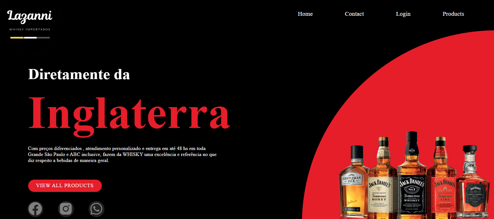

# 🌐 Projeto: Página Inicial Simples

Este é um projeto básico de **homepage estática** criada com **HTML5 e CSS3**, ideal para quem está iniciando no desenvolvimento web.  
A estrutura foi pensada para apresentar um produto, serviço ou marca com um visual limpo e objetivo.

---

## 🖼️ Visual da Página

## 📬 Contato 
- LinkedIn: [Edésio Rodrigues](https://www.linkedin.com/in/devedesio-rodrigues/)
