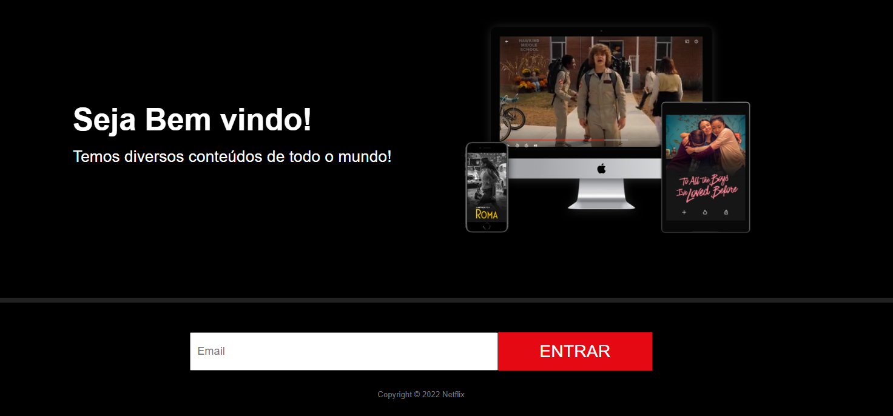

# 🎬 Clone Simples da Netflix - Página Inicial

Projeto básico de uma **landing page inspirada na Netflix**, criado com **HTML5 e CSS3**.  
Foi desenvolvido com fins educacionais, com estrutura visual semelhante à interface original, ideal para praticar HTML, CSS e layout responsivo.

---

## 🖼️ Visual da Página

| Seções incluídas | Capturas de tela |
|------------------|------------------|
| Home, chamada, entrada de e-mail e galeria final |  ![meio] (./docs/sessao2.png) !|

---

## 🧱 Tecnologias Utilizadas

- HTML5  
- CSS3  
- Fontes Google  
- Imagens e background fixo  
- Vídeos nas molduras

- ## 📬 Contato 
- LinkedIn: [Edésio Rodrigues](https://www.linkedin.com/in/devedesio-rodrigues/)
