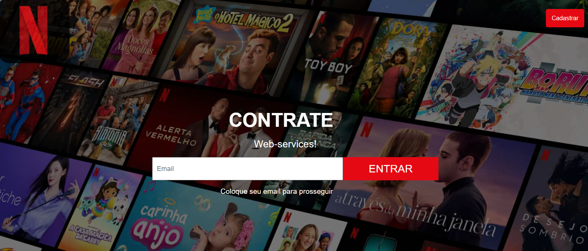

# 🌐 Projeto: Home Pages Front-End Puro

Este repositório agrupa páginas iniciais criadas com **HTML5 e CSS3**, com foco em aprendizado e construção visual.  
Cada pasta contém um projeto com estrutura própria, baseado em uma temática diferente.

---

## 🖼️ Visual Geral

---

## 📁 Projetos Incluídos

- 💈 **Barbearia** – Página de serviços visuais para barbearia
- 🥃 **Bebidas** – Landing de produtos importados (inspiração e-commerce)
- 🎬 **Netflix Clone** – Página inicial inspirada na plataforma da Netflix

---

## 💡 Objetivo

Este conjunto de páginas foi desenvolvido com foco em:

- Praticar estruturação com HTML5
- Aprender estilização com CSS puro
- Criar interfaces visuais modernas
- Separar projetos por temas para portfólio e reuso

---

## 🚀 Como visualizar

1. Acesse a pasta do projeto desejado
2. Abra o arquivo `index.html` no navegador

---

## 📄 Licença

Uso livre para fins de estudo e portfólio.

---

## 📬 Contato 
- LinkedIn: [Edésio Rodrigues](https://www.linkedin.com/in/devedesio-rodrigues/)
